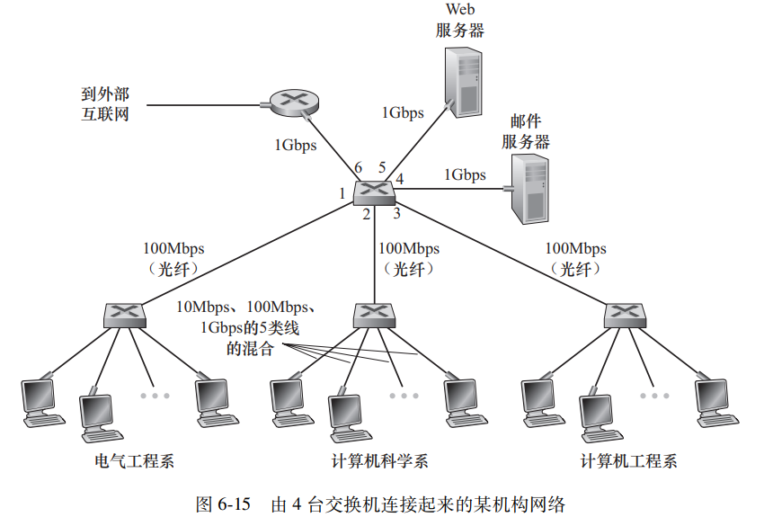
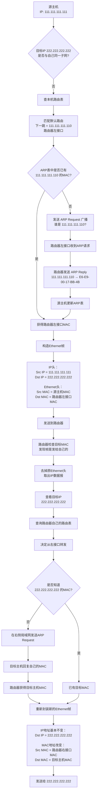

# 交换局域网

## 地址解析协议 （Address Resolution Protocol，ARP）
ARP表刚开始还没维护的时候 ip：111.111.11.111向 ip:222.222.222.222数据报，ARP怎么让报文往路由器发呢？

1. 源主机通过掩码发现不在本地子网，查路由表后没有更具体的匹配项，于是匹配默认路由，决定交给默认网关/下一跳路由器。
2. 主机不知道路由器的MAC，ARP request 局域网广播，等到路由器左接口收到回复，源主机维护ARP表
3. 构造链路层帧。目标 IP：222.222.222.222 但是目的 MAC是 路由器左接口
**IP 地址描述最终要去哪里，MAC 地址描述这一跳要交给谁。**
4. 路由器收到后把ethernet 头去掉去掉取出目的ip查自己路由表送出。

## 802.11 帧和 Ethernet 帧
到了 802.11 IP 仍然描述端到端目的地；链路层地址仍然负责“这一跳交给谁”。

802.11 Wi-Fi Frame
┌─────────────────────────────┐
│ 接收者 MAC：AP 的 MAC       │
│ 发送者 MAC：笔记本 Wi-Fi MAC│
├─────────────────────────────┤
│ IP Packet                   │
│ Src IP = 192.168.1.10       │
│ Dst IP = 8.8.8.8            │
├─────────────────────────────┤
│ FCS / CRC                   │
└─────────────────────────────┘

中间设备路由器，每一跳也会取出ip，改mac
收到 802.11 帧
↓
去掉 802.11 链路层头
↓
取出里面的 IP 数据报
↓
查目标 IP / 路由表
↓
决定下一跳
↓
重新封装新的链路层帧
↓
使用新的 MAC 地址

# 交换机
交换机环路容易导致广播风暴
简单即插即用，不用手动配置
