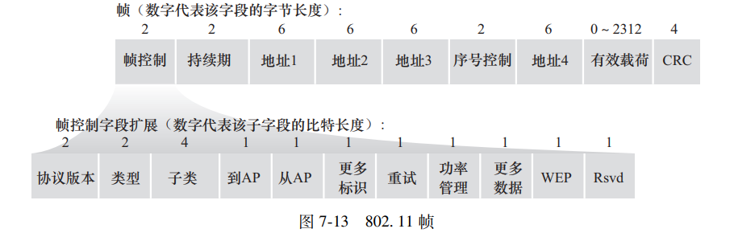

### AP 在 802.11 与以太网之间的作用

AP 可以理解为一个二层桥接设备，它连接无线局域网和有线以太网。无线侧使用的是 802.11 帧，而有线侧通常使用 Ethernet 帧，因此 AP 会在两种链路层帧格式之间进行转换。AP 本身一般不负责根据 IP 地址进行路由选择，真正进行三层转发的是路由器。

### R1 向 H1 发送数据

当路由器 R1 要向无线主机 H1 发送数据时，R1 先根据 H1 的 IP 地址和 ARP 表得到 H1 的 MAC 地址，然后在有线侧构造 Ethernet 帧。此时 Ethernet 帧的源 MAC 是 R1 的 MAC，目的 MAC 是 H1 的 MAC。这个 Ethernet 帧先到达 AP。

AP 收到 Ethernet 帧后，需要把它转换成 802.11 帧再通过无线信道发送给 H1。此时 802.11 帧中，地址1填写 H1 的 MAC，表示无线链路上的接收者；地址2填写 AP 的 MAC，表示无线链路上的发送者；地址3填写 R1 的 MAC，用来保留原始有线网络中的发送方地址。于是 H1 可以知道，这个无线帧虽然是 AP 发给自己的，但原始数据实际上来自 R1。

### H1 向 R1 发送数据

当 H1 要向外部网络发送数据时，H1 知道下一跳是路由器 R1，并通过 ARP 获得 R1 的 MAC 地址。H1 首先构造 802.11 帧，其中地址1是 AP 的 MAC，因为当前无线链路的直接接收者是 AP；地址2是 H1 自己的 MAC，因为 H1 是当前无线帧的发送者；地址3则是 R1 的 MAC，表示 AP 收到该帧后应该把数据继续转发给 R1。

AP 收到这个 802.11 帧后，会把它转换成 Ethernet 帧。在 Ethernet 帧中，源 MAC 变成 H1 的 MAC，目的 MAC 变成 R1 的 MAC，然后通过有线局域网发送给 R1。R1 收到之后再根据 IP 数据报中的目的 IP 地址查路由表，决定下一跳。

### 总结

AP 的核心作用之一，就是在无线 802.11 网络和有线 Ethernet 网络之间进行二层桥接。无线侧需要使用 802.11 帧，并且通常包含多个 MAC 地址字段，用来区分无线发送者、无线接收者以及原始源或目的设备；有线侧则转换成普通 Ethernet 帧。可以简单记成：**AP 负责二层帧格式转换和无线接入，路由器负责三层 IP 转发。**
