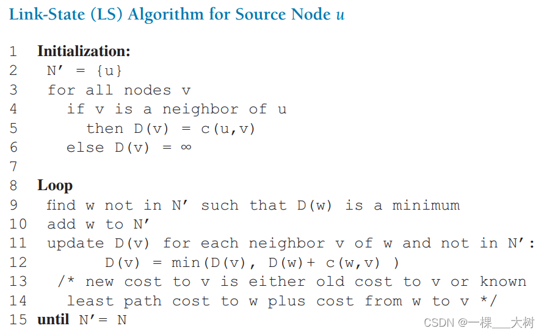
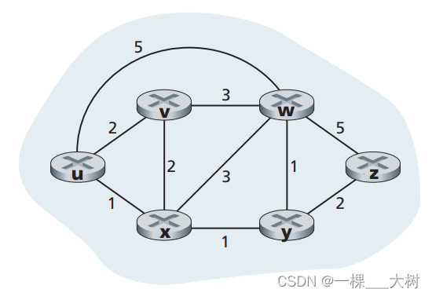
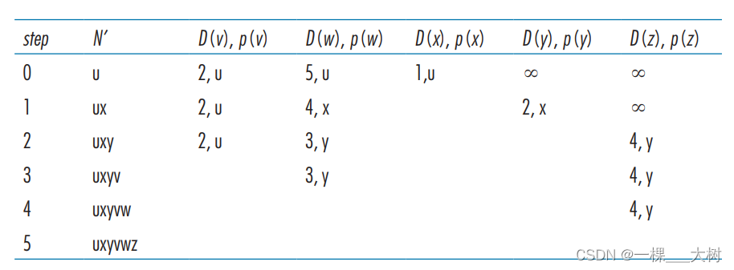
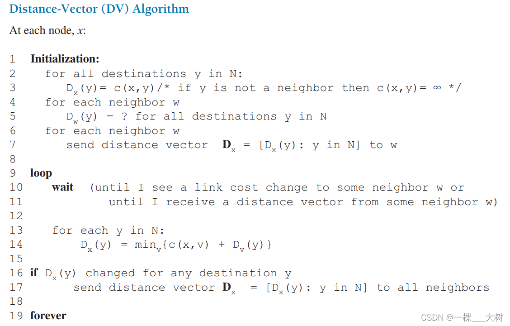
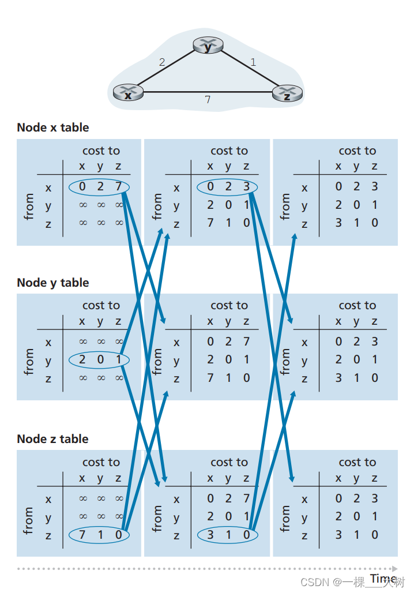

#
## LS 




LS（Link State）算法本质上使用的是 Dijkstra 最短路径算法。对于源节点 `u`，首先初始化集合 `N'={u}`，表示目前已经确定最短路径的节点只有源节点自身。然后检查网络中的所有节点 `v`：如果 `v` 是 `u` 的直接邻居，则令 `D(v)=c(u,v)`，其中 `c(u,v)` 表示 `u` 到 `v` 的链路代价；如果不是直接邻居，则令 `D(v)=∞`。

初始化完成后进入循环。每一轮从所有不在 `N'` 中的节点里，选择当前 `D(w)` 最小的节点 `w`，并将 `w` 加入 `N'`。这表示从源节点 `u` 到节点 `w` 的最短路径已经确定。随后检查 `w` 的所有尚未加入 `N'` 的邻居 `v`，计算如果经过 `w` 到达 `v`，新的路径代价是否更小，即比较：

`D(v)` 和 `D(w) + c(w,v)`

如果经过 `w` 的路径更短，就更新：

`D(v) = D(w) + c(w,v)`

同时令 `p(v)=w`，表示当前最短路径中，`v` 的前驱节点变成了 `w`。如果新的路径没有更短，则保持原来的 `D(v)` 不变。

整个过程可以概括为：

**找出当前距离最小的节点 → 加入 `N'` → 利用该节点更新其邻居的距离 → 重复执行。**

直到 `N'=N`，即所有节点都已经加入 `N'`，算法结束。此时就得到了源节点 `u` 到网络中所有其他节点的最短路径。

## DV




DV（Distance Vector，距离向量）算法的核心思想是：**路由器不需要知道整个网络拓扑，只需要知道自己到邻居的链路代价，以及邻居到各个目的节点的距离。** 每个节点维护一个距离向量 `Dₓ`，其中 `Dₓ(y)` 表示节点 `x` 当前认为自己到目的节点 `y` 的最小代价。

初始化时，节点只知道自己和直接邻居之间的链路代价。如果 `y` 是 `x` 的邻居，则：

`Dₓ(y) = c(x,y)`

如果不是直接邻居，则先设置为：

`Dₓ(y) = ∞`

随后，每个节点会把自己的距离向量发送给邻居。当节点 `x` 收到邻居 `v` 的距离向量后，会利用 Bellman-Ford 公式重新计算自己到各个目的节点的最短距离：

`Dₓ(y) = minᵥ { c(x,v) + Dᵥ(y) }`

这句话的含义是：节点 `x` 想去目的节点 `y` 时，可以尝试先经过不同的邻居 `v`。经过某个邻居的总代价等于“`x` 到邻居 `v` 的链路代价”加上“邻居 `v` 到目的节点 `y` 的距离”，然后从所有邻居中选择总代价最小的路径。

例如网络中：

`x --2-- y --1-- z`

同时 `x` 和 `z` 之间存在一条代价为 `7` 的直接链路。最开始节点 `x` 认为：

`Dₓ = [0, 2, 7]`

当 `x` 收到节点 `y` 的距离向量：

`Dᵧ = [2, 0, 1]`

后，`x` 会重新计算到 `z` 的距离。直接到 `z` 的代价是 `7`，而经过 `y` 到 `z` 的代价为：

`c(x,y) + Dᵧ(z) = 2 + 1 = 3`

因此：

`Dₓ(z) = min(7, 3) = 3`

节点 `x` 的距离向量就更新为：

`Dₓ = [0, 2, 3]`

如果一个节点的距离向量发生变化，它会把新的距离向量继续发送给邻居；邻居收到后再重新计算自己的距离向量。如果没有变化，则不需要继续发送更新。因此 DV 的工作过程可以概括为：

**初始化距离向量 → 与邻居交换距离向量 → 根据邻居信息重新计算 → 如果发生变化就继续通知邻居 → 重复执行。**

当所有节点继续交换信息后，距离向量都不再发生变化时，就称网络已经达到**收敛（Convergence）**状态。需要注意的是，单个节点通常无法瞬间确定“整个网络已经收敛”，收敛是整个网络的全局稳定状态。

DV 算法的特点是节点之间只交换距离信息，而不会获得完整的网络拓扑，因此它可以理解为：

**“我不知道整个网络怎么连接，但我知道邻居告诉我它到目的地有多远。”**

这也是 DV 和 LS 算法最大的区别：LS 会获得完整网络拓扑并运行 Dijkstra 算法，而 DV 只和邻居交换距离向量，并使用 Bellman-Ford 思想逐步计算最短路径。

# BGP
OSPF 解决“一个组织内部怎么选路”，BGP 解决“不同组织/自治系统之间怎么选路”。

而 AS（Autonomous System，自治系统），就是把互联网划分成很多“独立管理的网络区域”。
## AS 
                Internet
                   │
        ┌──────────┼──────────┐
        │          │          │
      AS100      AS200      AS300
        │          │          │
      OSPF       OSPF       OSPF
        │          │          │
   内部路由器   内部路由器   内部路由器

AS 与 AS 之间：
        ←──── BGP ────→

假设全球所有路由器都运行一个 OSPF，全球几百万台路由器，所有链路状态都要传播，每台路由器都维护巨大拓扑，每台路由器都跑 SPF。所以互联网进行了分层。

**AS 不是根据 IP 地址或子网掩码自动划分的。AS 是人为/组织层面定义的管理域，并且有专门的 ASN（自治系统号）标识。**

## BGP、OSPF 与 AS 的关系示例

假设有两个自治系统：

- `AS100`：运营商 A
- `AS200`：运营商 B

网络拓扑：

```text
              AS100
      ┌─────────────────┐
      │                 │
 PC1──R1────R2────R3    │
      │        OSPF     │
      └────────┬────────┘
               │
               │ eBGP
               │
      ┌────────┴────────┐
      │                 │
      │   R4────R5──Server
      │        OSPF     │
      └─────────────────┘
              AS200

```

AS100：PC1 = 10.1.1.10/24
AS200：Server = 172.20.5.10/24


- AS200 通过 BGP 告诉 AS100：172.20.5.0/24 可以通过 AS200 到达

于是 AS100 的边界路由器 R3 学到类似信息：
目标前缀：
172.20.5.0/24

下一跳：
192.0.2.2

AS-PATH：
200

- PC1 访问 Server
AS100内部由 OSPF 负责 PC1 → R1 → R2 → R3
R3 到 R4 使用 BGP
AS200 内部继续由 OSPF 负责R4 → R5 → Server

**AS100中pc1向AS200pc2通讯**
1. AS200 内部通过 OSPF 学习并计算 PC2 所在网段的内部路径。
2. AS200 的边界路由器通过 BGP 向 AS100 宣告 PC2 所在网段可达。
3. AS100 的边界路由器通过 BGP 学习到这条外部路由。
4. AS100 内部通过 OSPF （等路由机制），确定如何到达对应的出口路由器。

# IP-anycast (IP 任播)

有个很混淆的是 DNS 和 IP-anycast不一样
先解释 DNS 和 CDN
**CDN（Content Delivery Network，内容分发网络）**是把网站的内容复制或缓存到不同地区的服务器上。**DNS** 负责域名解析，而 CDN 可以利用 DNS 进行调度，例如中国用户访问 apple.com 时 DNS 返回中国 CDN 节点的 IP，美国用户访问相同域名时返回美国 CDN 节点的 IP。
因此效果是：访问相同域名，但解析得到不同 IP，最终连接不同的 CDN 服务器。

**IP Anycast** 则不同。多个位于不同网络位置的服务器使用相同的 IP 地址，并从多个位置通过 BGP 宣告相同的 IP 前缀。这些路由经过 BGP 在 AS 之间传播，用户所在的 AS 最终可能学习到多条到达该 IP 前缀的路径，并按照 BGP 路由选择策略选择最佳路径。
因此效果是：访问相同域名，甚至得到完全相同的 IP，但不同地区的用户最终可能被路由到不同的服务器。

# ICMP

ICMP（Internet Control Message Protocol，互联网控制报文协议）是网络层中的控制与差错报告协议，主要用于主机和路由器之间传递网络状态信息，而不是传输网页、文件等应用数据。常见用途包括 `ping` 和 `traceroute`：`ping` 通过 ICMP Echo Request / Echo Reply 判断目标是否可达；`traceroute` 则利用 TTL 逐跳递减，并接收路由器返回的 ICMP Time Exceeded，从而获得路径上的路由器信息。ICMP 还可以报告 Destination Unreachable 等网络层错误。ICMP 不使用 TCP 或 UDP 端口，而是直接封装在 IP 数据包中。可以简单理解为：**IP 负责“把数据送过去”，ICMP 负责“告诉发送方送的过程中发生了什么”。**

# SNMP

SNMP（Simple Network Management Protocol，简单网络管理协议）是应用层的网络管理协议，用于远程监控和管理路由器、交换机、服务器等网络设备。SNMP 通常采用 Manager-Agent 模型：Manager 是网络管理服务器，Agent 运行在被管理设备上；设备的 CPU、接口状态、流量、丢包数、运行时间等信息组织在 MIB（Management Information Base）中，并通过 OID（Object Identifier）标识。Manager 可以通过 GET 查询设备状态，也可以通过 SET 修改部分参数；当设备发生接口断开等事件时，Agent 还可以通过 TRAP 主动向 Manager 报警。SNMP 通常使用 UDP 161 端口进行查询和响应，UDP 162 端口接收 Trap。可以简单理解为：**OSPF/BGP 负责“网络应该怎么走”，而 SNMP 负责“网络设备现在运行得怎么样”。**

# 问题
**那攻击这个AS之间的边界路由器岂不是很有效？**
回答：边界路由器是 AS 对外通信的重要出口，但成熟网络不会把整个 AS 的外部连通性押在一台边界路由器上，而是通过多出口和 BGP 冗余消除单点故障。