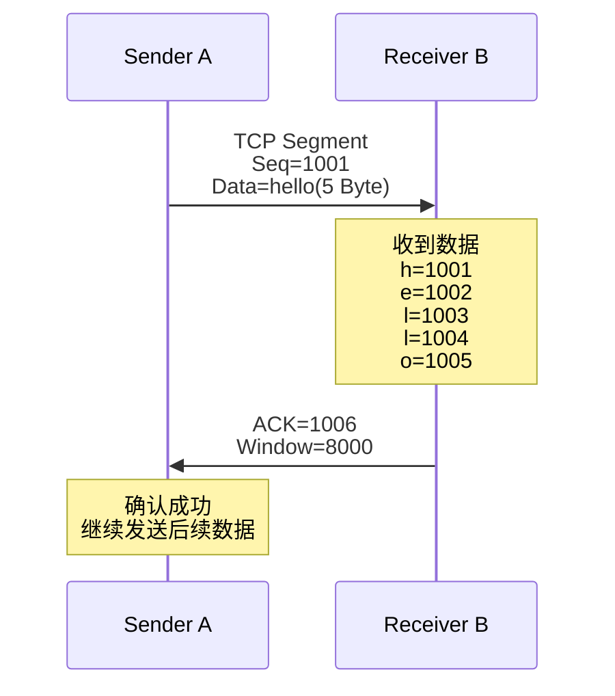
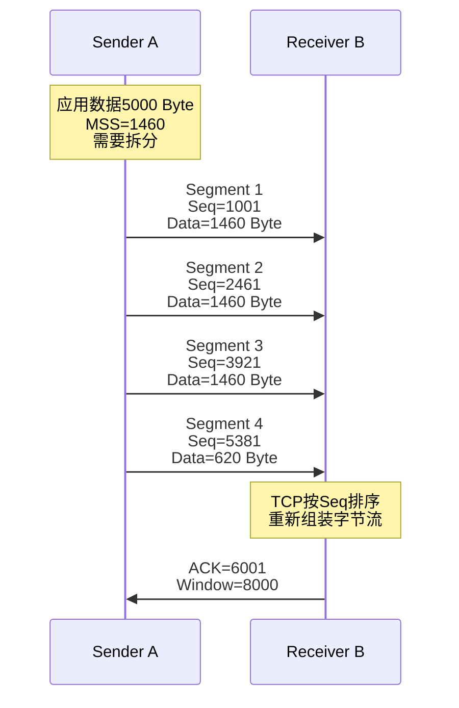

# TCP 头部组成
## 疑问
1. 源端口号和目的端口号它们16bit是不包含ip地址的吗？只包含端口号吗？是在ip头部才有吗？
回答：不包含。TCP头部的16bit端口字段只包含端口号，不包含IP地址。IP地址在IP头部里面。
2. 这个接受窗口意思是数据包的数目，还是说一个数据包的大小
TCP接收窗口表示接收方还能接收多少“字节”的数据。

**TCP不是按字符编号，而是按字节编号。**

|          | hello  | 大数据               |
| -------- | ------ | ----------------- |
| 数据大小     | 5 Byte | 10000 Byte        |
| 是否超过MSS  | 否      | 是                 |
| TCP段数量   | 1个     | 多个                |
| Seq变化    | 1001   | 1001、2461、3921... |
| ACK方式    | 一次确认   | 累计确认              |
| 是否需要窗口控制 | 基本无感   | 明显影响              |

## 传输 5 Byte

虽然是多个但是只给最后的ACK，不存在中间的ACK=1004 因为是整包的

## 传输 5000 Byte MSS 1460 Byte

超过 MSS，拆开成多段，存在后段先到可能。比如segment 3 4 先到，会重新发送ACK = 1001

## 新理解
两个重复ACK只能说明“前面的某个数据没有连续到达”，无法定位；三个重复ACK时，TCP推断最前面的未确认Segment丢失，并触发快速重传。

比如收到了Segment34，发送了两个 ACK 1001，对于客户端来说，实际上有可能是Segment 1&3丢失，也可能是Segment 1&4 丢失；只有收到了三个 ACK 1001，才一定是Segment 1丢失。（时间足够久，不考虑Segment 1特别慢的特殊情况）