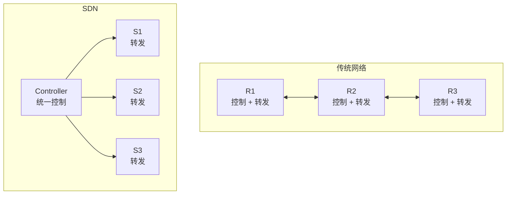
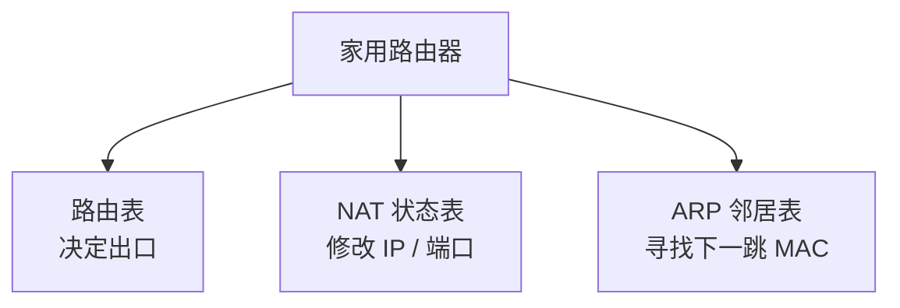
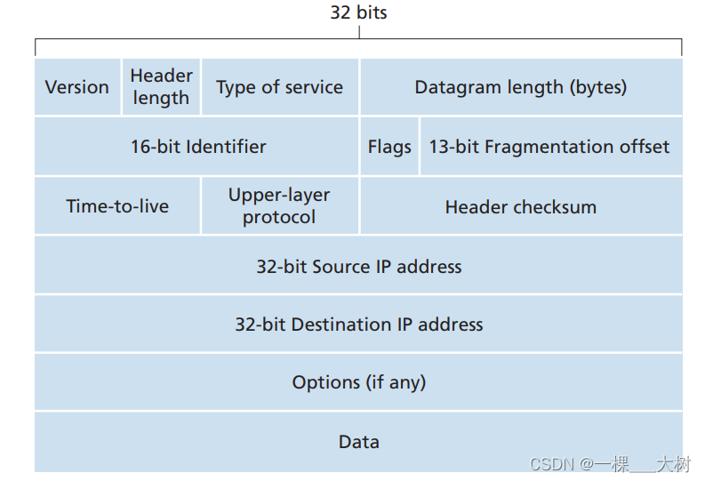
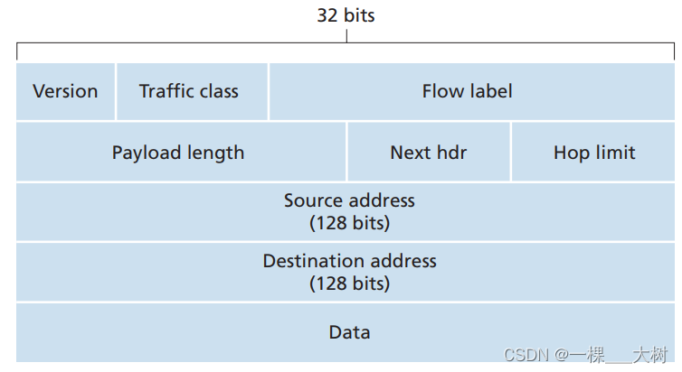

# SDN 与传统网络

## 控制平面与数据平面

**控制平面** 应该怎么路由
**数据平面** 按照已经决定的路线，转发包

在传统网络中，每个路由器都单独算自己拿到包后到目的地址的路线（控制平面），有了既定路线之后，以后同目的ip的包就可以直接按照路线转发（数据平面）。

在 SDN 中，SDN controller集中控制，不需要每个路由器再进行计算路线了，控制平面和数据平面实现分离，交换机直接根据路线转发包。

# DHCP (Dynamic Host Configuration Protocol)
主机地址的配置
## DORA
- Discover
“有没有 DHCP 服务器？给我分个地址。” 
- Offer
“你可以用 192.168.1.100。”
-  Request
“我想使用 192.168.1.100。”
- ACK
“可以，这个地址租给你。”
## **例子1** 路由器作为DHCP服务器
手机
  ↓ 连接 Wi-Fi
  ↓
发送 DHCP Discover
  ↓
路由器里的 DHCP 服务收到
  ↓
返回 DHCP Offer
  ↓
手机发送 DHCP Request
  ↓
路由器返回 DHCP ACK
  ↓
分配局域网参数

## **例子2** 路由器作为DHCP客户端

家用路由器
   ↓ WAN口启动
   ↓
发送 DHCP Discover
   ↓
运营商 DHCP 服务器收到
   ↓
返回 DHCP Offer
   ↓
家用路由器发送 DHCP Request
   ↓
运营商返回 DHCP ACK
   ↓
家用路由器获得 WAN 口网络参数

# NAT (Network Address Translation)
NAT不是路由表，路由器里确实会有路由表，做 NAT 的设备还会维护 NAT 映射

数据包到达路由器
    ↓
判断目标是否是本地网络
    ↓
查路由表，决定从哪个接口出去
    ↓
如果跨内外网且配置了 NAT
    ↓
进行地址/端口转换
    ↓
从对应接口转发

| 情况            | 怎么处理                   |
| ------------- | ---------------------- |
| 同一子网          | 主机直接二层通信，通常不经过路由器      |
| 不同内部子网        | 需要路由器查路由表转发，但通常不需要 NAT |
| 内网 → Internet | 路由器查路由 + 通常做 NAT       |

# ipv4和ipv6

地址 32→128 位、头部固定 40B、删除头部校验和、分片从基本头移到扩展头且中间路由器不再分片。

# 问题
**DHCP 服务的加密安全问题，他是明文的？**
如果伪造 DHCP 服务器，并把客户端的 DNS 配置成自己控制的 DNS，将网址解析到恶意的ip地址。
如果是http就会中招
但是https 用tls验证，

网站向浏览器发送 *证书内容* 和 *CA 数字签名*
- 证书内容做 hash 
- CA 签名执行公钥运算
看二者是否一致
