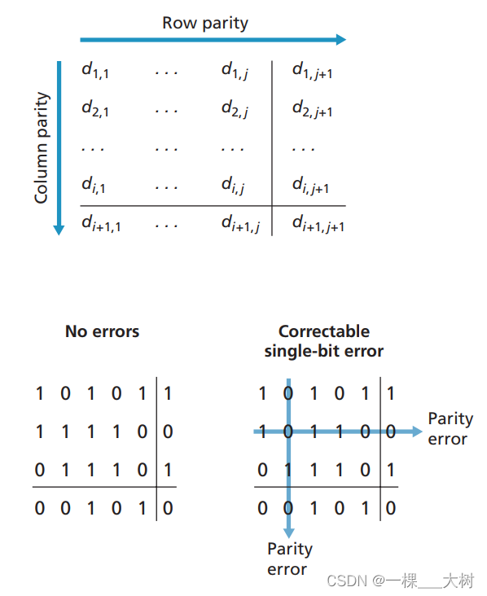
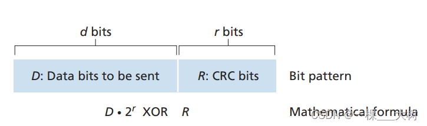
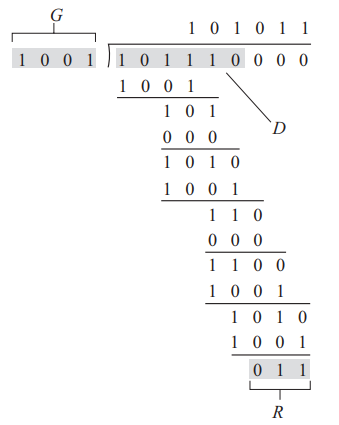
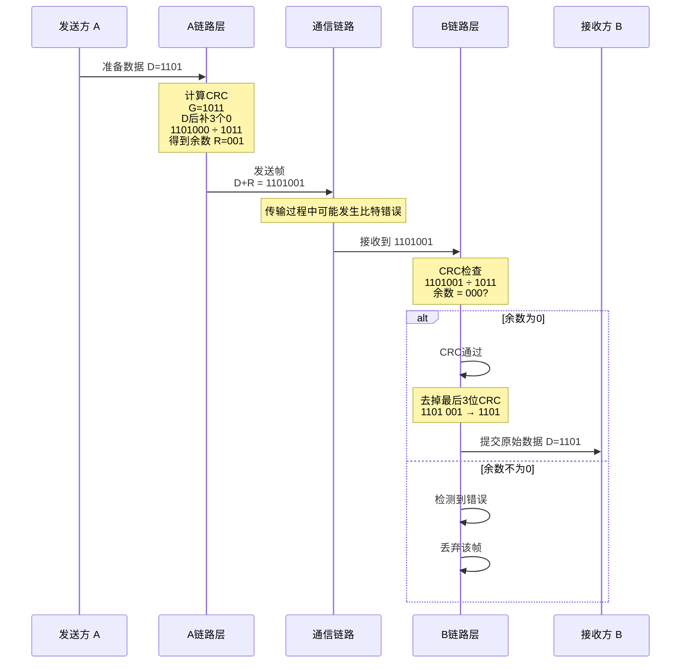
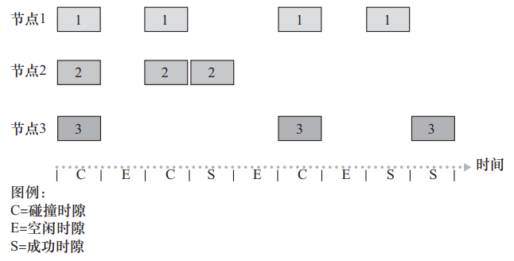
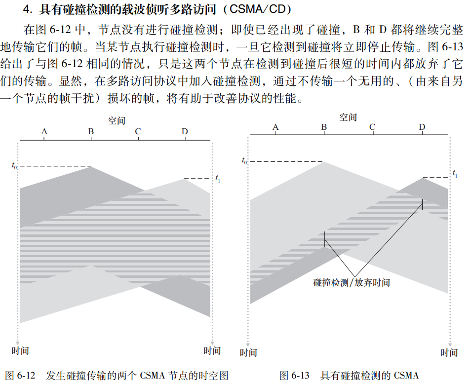

# 差错检测和纠正技术

## 奇偶校验

只能检测不能纠错，不能检测超过1比特位的错误  

能检测并纠正1bit差错；

## 检验和方法
因特网检验和（Internet checksum） 基于这种方法，即数据的字节作为16比特的整数对待并求和。
如果多组校验，同一个位置偶数次出错就检测不出来

## 循环冗余检测 (Cyclic Redundancy Check，CRC)
除数是4位，余数最多位，所以补3位0

# 多路访问链路和协议

## 信道划分协议
TDM FDM CDMA
## 随机接入协议
### ALOHA

### 载波侦听多路访问
载波侦听多路访问 （Carrier Sense Multiple Access，CSMA）和具有
碰撞检测的 CSMA（CSMA with Collision Detection，CSMA / CD）

## 轮流协议
选定主节点决定其他节点的可传输帧的数量
问题：时延、中心化

